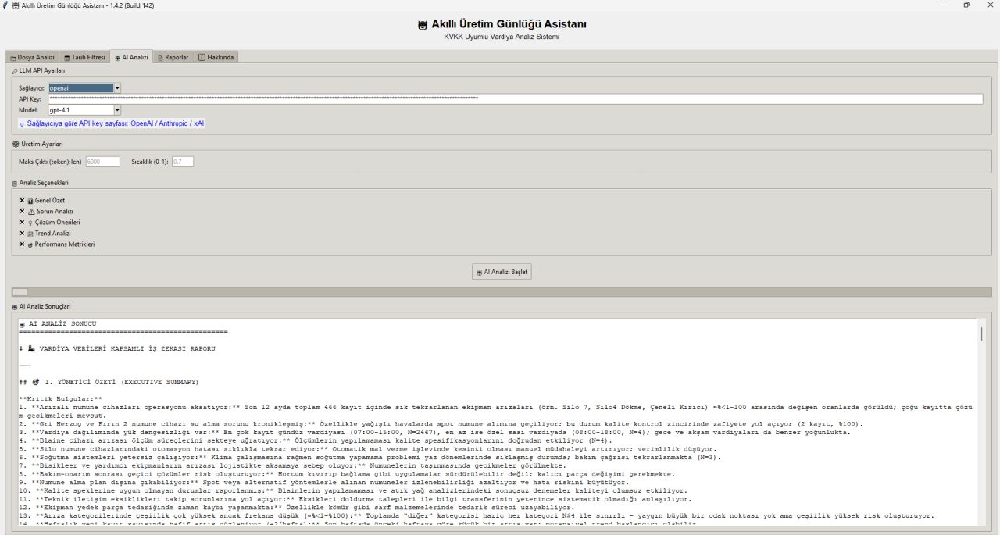
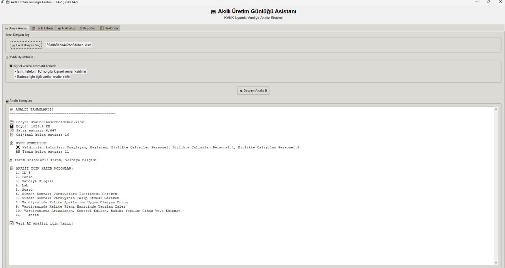
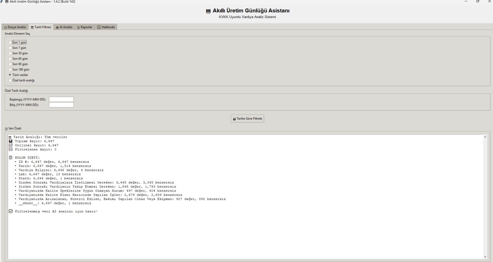
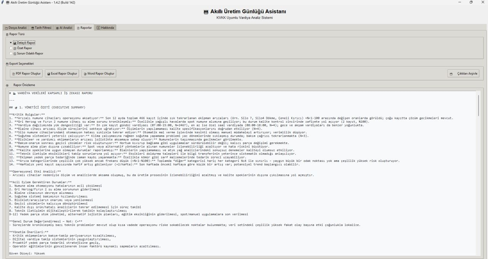

<div align="center">

# Akıllı Üretim Günlüğü Asistanı

**Excel tabanlı vardiya kayıtlarını hazırlayan, filtreleyen ve yapay zekâ destekli operasyon raporlarına dönüştüren masaüstü uygulaması.**

[](CHANGELOG.md)
[](requirements.txt)
[](#kurulum)
[](LICENSE)

Vardiya defteri kayıtlarından dönem özeti, tekrar eden sorunlar, operasyonel bulgular ve aksiyon önerileri üretmek için geliştirilmiş bir **staj/portföy projesidir**.

</div>



## Projenin amacı

Üretim sahalarında vardiya kayıtları çoğunlukla Excel dosyalarında ve serbest metin alanlarında tutulur. Bu proje, söz konusu kayıtları tek bir masaüstü akışında işleyerek aşağıdaki süreci kolaylaştırmayı amaçlar:

1. Excel dosyasını içe aktarır.
2. Kişisel veri olabilecek kolonları sezgisel kurallarla belirler.
3. Kayıtları seçilen tarih aralığına göre filtreler.
4. Veriyi seçilen LLM sağlayıcısıyla analiz eder.
5. Sonucu uygulamada gösterir ve PDF/Excel raporu olarak dışa aktarır.

```text
Excel dosyası
      │
      ▼
Dosya kontrolleri ──► kişisel veri minimizasyonu ──► tarih filtresi
                                                        │
                                                        ▼
                                              LLM destekli analiz
                                                        │
                                                        ▼
                                               PDF / Excel raporu
```

## Ekran görüntüleri

<table>
  <tr>
    <td width="50%"></td>
    <td width="50%"></td>
  </tr>
  <tr>
    <td align="center"><strong>Veri hazırlama</strong><br>Kolon analizi ve kişisel veri olabilecek alanların ayrılması</td>
    <td align="center"><strong>Tarih filtreleme</strong><br>Dönem seçimi ve kolon bazlı veri özeti</td>
  </tr>
  <tr>
    <td width="50%"></td>
    <td width="50%"></td>
  </tr>
  <tr>
    <td align="center"><strong>AI analizi</strong><br>Yönetici özeti, sorunlar ve öneriler</td>
    <td align="center"><strong>Rapor önizleme</strong><br>Sonucun dışa aktarılmadan önce incelenmesi</td>
  </tr>
</table>

> Ekran görüntülerindeki API anahtarı alanı maskelidir. Depoda API anahtarı veya Excel kaynak dosyası tutulmaz.

## Öne çıkan özellikler

- `.xlsx` vardiya kayıtlarını okuma (`.xls` desteği ortam ve `xlrd` uyumluluğuna bağlıdır)
- Birden fazla Excel sayfasını birleştirerek analiz etme
- Kolon adı ve içerik örnekleri üzerinden kişisel veri adayı tespiti
- 1/7/30/60/90/180 günlük veya özel tarih aralığı filtresi
- OpenAI, Anthropic ve xAI sağlayıcı seçenekleri
- Yönetici özeti, sorun analizi, çözüm önerileri ve trend değerlendirmesi
- PDF ve Excel rapor çıktısı
- JSON biçiminde yerel işlem/audit kayıtları
- Dosya boyutu, uzantı ve imza kontrolleri

## Kurulum

### Gereksinimler

- Windows 10 veya 11
- Python 3.8+
- Tkinter (standart Python Windows kurulumunda genellikle hazır gelir)
- AI analizi için desteklenen sağlayıcılardan bir API anahtarı

### Hızlı başlangıç

```powershell
git clone https://github.com/Merd0/ai-shift-analysis-assistant.git
cd ai-shift-analysis-assistant

python -m venv .venv
.\.venv\Scripts\Activate.ps1
python -m pip install --upgrade pip
python -m pip install -r requirements.txt

python vardiya_gui.py
```

Windows terminalinde emoji karakterleriyle ilgili bir kodlama hatası görülürse uygulama UTF-8 modu etkinleştirilerek başlatılabilir:

```powershell
$env:PYTHONUTF8 = "1"
python vardiya_gui.py
```

## Kullanım

1. **Dosya Analizi** sekmesinden Excel dosyasını seçin.
2. Dosya kontrolü ve kolon analizini çalıştırın.
3. **Tarih Filtresi** sekmesinden analiz dönemini belirleyin.
4. **AI Analizi** sekmesinde sağlayıcı, model ve API anahtarını girin.
5. Analiz sonucunu gözden geçirin.
6. **Raporlar** sekmesinden PDF veya Excel çıktısı oluşturun.

Uygulama ayrıca aşağıdaki demo menüsüyle başlatılabilir:

```powershell
python demo.py
```

## Beklenen veri yapısı

Uygulama Türkçe ve İngilizce kolon adlarını sezgisel olarak tanımaya çalışır. Sabit bir şema zorunlu değildir; ancak aşağıdaki türde kolonlar sonuç kalitesini artırır:

| Alan | Örnek kolonlar | Açıklama |
|---|---|---|
| Zaman | `Tarih`, `Date`, `Zaman` | Kayıt veya vardiya zamanı |
| Vardiya | `Vardiya`, `Shift` | Vardiya adı ya da saat aralığı |
| Ekipman | `Makine`, `Ekipman`, `Unit` | Ünite veya ekipman bilgisi |
| Olay | `Sorun`, `Açıklama`, `Description` | Operasyon kaydı |
| Aksiyon | `Çözüm`, `Bakım`, `Action` | Uygulanan ya da önerilen işlem |

Gerçek üretim verisini kullanmadan önce dosyanın yedeğini alın ve kişisel/kurumsal hassas alanları ayrıca kontrol edin.

## Proje yapısı

```text
.
├── vardiya_gui.py       # Tkinter masaüstü arayüzü
├── excel_analyzer.py    # Excel okuma, temizleme ve özetleme
├── ai_analyzer.py       # LLM sağlayıcıları ve analiz akışı
├── prompts.py           # Analiz istemleri
├── file_security.py     # Dosya türü ve bütünlük kontrolleri
├── security_audit.py    # Yerel audit kayıtları
├── config.py            # Sağlayıcı/model yapılandırması
├── demo.py              # Konsol ve GUI demo menüsü
├── version.py           # Sürüm bilgileri
└── docs/screenshots/    # README ekran görüntüleri
```

## Güvenlik ve kişisel veriler

Bu proje kişisel veri minimizasyonuna yardımcı olan **sezgisel** kontroller içerir; hukuki veya teknik olarak eksiksiz KVKK uyumluluğu garanti etmez.

- Yanlış pozitif ve yanlış negatif tespitler oluşabilir.
- AI sağlayıcısına gönderilecek veri kullanıcı tarafından kontrol edilmelidir.
- Sağlayıcının veri saklama ve işleme koşulları ayrıca değerlendirilmelidir.
- Üretim ortamında kullanımdan önce erişim kontrolü, şifreleme, veri saklama politikası ve güvenlik testi eklenmelidir.
- AI tarafından üretilen bulgular uzman doğrulaması olmadan operasyonel karar olarak uygulanmamalıdır.

Güvenlik bildirimi için [SECURITY.md](SECURITY.md) dosyasına bakın.

## Bilinen sınırlamalar

- Uygulama masaüstü prototipidir ve çok kullanıcılı değildir.
- Kişisel veri tespiti kural/sezgi tabanlıdır.
- Kolon adları ve serbest metin yapısı sonuç kalitesini etkiler.
- AI çıktısı sağlayıcıya, modele ve kaynak verinin kalitesine göre değişebilir.
- Word dışa aktarma düğmesi mevcut sürümde henüz işlevsel değildir.
- Otomatik dosya kontrolleri antivirüs veya sandbox yerine geçmez.

## Yol haritası

- Fabrika/tesis bazlı kolon eşleştirme profilleri
- Kanıta bağlı yapılandırılmış AI çıktıları
- Deterministik KPI ve anomali katmanı
- Otomatik testler ve veri kalitesi kontrolleri
- Web tabanlı, çok kullanıcılı sürüm araştırması

## Proje bağlamı

Bu uygulama, üretim sahasındaki vardiya kayıtlarını daha hızlı inceleme ihtiyacından doğan bir staj projesidir. Depo; çalışan bir prototipi, veri gizliliği farkındalığını ve üretim verisi üzerinde AI destekli analiz yaklaşımını göstermek amacıyla yayımlanmaktadır.

## Lisans

Proje [MIT Lisansı](LICENSE) ile yayımlanmıştır.
